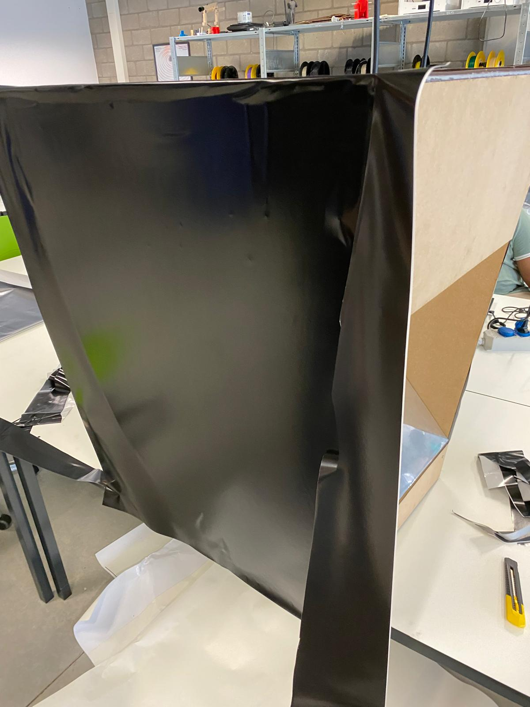
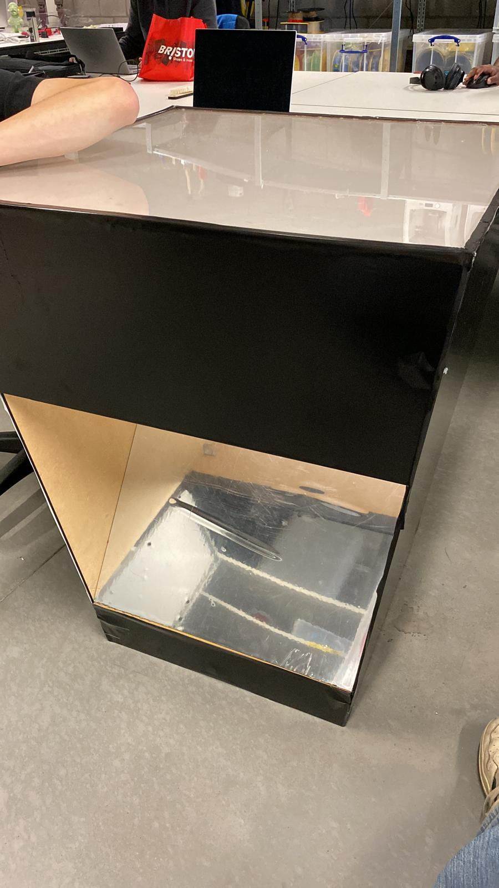

# Symphony of Life - An Audioreactive Table
##### By Behive - [Visit our website!](https://symphonyoflife-groep2.webflow.io/)

[](https://www.youtube.com/watch?v=y6DZfVRRVj0)

Our interactive art installation, ‘Symphony of Life’, revolves around the choices we make in life and the lasting impact they have. We challenge visitors to experience this by moving physical blocks with markers on a tabletop, taking their life - literally - in their own hands. Each movement translates to a change in the audiovisual experience.
This concept reflects the idea that by making choices, you have control over your life and your life takes direction. Through our choices, we avoid going through life passively and let no opportunity pass us by in life.

The installation consists of a square table on which different blocks ('totems') can be placed. Each totem symbolises a choice or aspect of life, like love, ambition, creativity, or change. By displacing a block, the tabletop projection and accompanying soundscape adjust, letting you experience first-hand how this choice affects your path of life.

#### Behind the Curtain
Above the table, an **IR camera** continuously registers the markers on the blocks and translates this data to positions and orientations using **OpenCV in Python**. The processed information is then passed to **TouchDesigner**, where the dynamic visuals and audio are updated in real time and projected onto the tabletop through means of a mirror and beamer.

## Supplies
Everything you need to complete this project.
#### Tools
- FDM 3D printer (w/ 0.4 mm nozzle)
- Glue gun
- Hand drill w/ a 3 mm bit
- Laser cutter (or alternatively a jigsaw)
- Ruler or tape measure
- Sandpaper (fine grain)
- Stanley (utility) knife
- Wrench

#### Materials
- 4x Cardboard tubes or wooden slats
  - 200 x 40 x 40 mm
- Glue (for glue gun)
- 16x M4 bolts + washers
- MDF sheets for following pieces:
  - 3x 700 x 900 x 6 mm
  - 1x 700 x 100 x 6 mm
  - 1x 700 x 400 x 6 mm
  - 2x 500 x 500 x 6 mm
  - 4x 700 x 30 x 3 mm
  - 1x 150 x 150 x 3 mm
- 8x Metal L-brackets
- Mirror film/foil (min 800 x 500 mm)
- Paper tape
- PLA filament (for 3D printing)
- 2x Plexiglass sheet
  - 1x 700 x 700 x 3 mm
  - 1x 500 x 800 x 3 mm
- Regular printer (A4 / Letter)
- Self-adhesive vinyl or sticker paper (black)
- Tracing paper 710 x 710 mm
- (Optional) Pose estimation markers (we will be making these)
- (Optional) Wood glue 

#### Software
- 3D Modelling Suite (Blender / Maya / Cinema 4D) 
- IDE w/ support for Python
- Python v3.13
- TouchDesigner 2023.12230

#### Electronics
- Beamer
- IR Camera
- 1 or more speakers
- Laptop or desktop

> Note: For your convenience, each of the sections' supply lists are limited to items that are relevant for that specific section, so if you're only interested in certain sections, jump straight into them and gather supplies based on those lists.

## Constructing the Table
We construct our own functional table that sports a built-in mirror and an access hole for the projected view. With the mirror on an angle, a semi-transparent tabletop, and a closed structure, we get the perfect projection setup.

<details>
<summary>View steps</summary>

### Step 0: Gather Supplies
#### Tools
- Glue gun
- Hand drill w/ a 3 mm bit
- Laser cutter (or alternatively a jigsaw)
- Ruler or tape measure
- Sandpaper (fine grain)
- Stanley (utility) knife
- Wrench

#### Materials
- 4x Cardboard tubes or wooden slats
  - 200 x 40 x 40 mm
- Glue (for glue gun)
- 16x M4 Bolts (40 mm) + washers
- MDF sheets
  - 3x 700 x 900 x 6 mm
  - 1x 700 x 100 x 6 mm
  - 1x 700 x 400 x 6 mm
  - 2x 500 x 500 x 6 mm
  - 4x 700 x 30 x 3 mm
  - 1x 150 x 150 x 3 mm
- 8x Metal L-brackets
- Mirror film/foil (min 800 x 500 mm)
- Paper tape
- Plexiglass sheets
  - 1x 700 x 700 x 3 mm
  - 1x 500 x 800 x 3 mm
- Tracing paper 710 x 710 mm
- Wood glue (optional)

### Step 1: Preparation & Calculations
Before we can start building the table, we need to accurately measure all the different components and draw them correctly. We decided to go for a square table that tapers towards the bottom:


*tabletop: 70 × 70 cm; bottom: 50 × 50 cm; height: 90 cm; side panels taper down*


*Distance required to fill the entire 70 x 70 cm tabletop = 270 cm. Distance from the beamer to the table access hole = 180 cm. Therefore, the hole needs to be at least 50 x 50 cm*

You are free to follow the design above or choose your own (advanced). Whichever you choose, first, draw out the design on paper. It doesn't have to be accurate as long as it makes sense. Then, measure the different sizes you need and annotate your drawing with them before continuing to the next step.

The mirror must be placed on a 45 degree angle, so the projection can be reflected vertically and cast onto the tabletop from below. Take this into account when calculating the size of the hole.

<blockquote>
<details>
<summary>Tips when designing your own table</summary>

Unless you are using a short-range beamer, the proportion between the size of the tabletop and the height of the table is rather fixed.

When using a normal beamer, it must be placed outside of the table due to the distance required to fill the entire surface, which means that an access hole for the projection needs to be cut. The size of this hole is limited to the width of a single side and depends on the tabletop size (the bigger the tabletop, the bigger the hole), the height of the table (the taller the table, the smaller the hole).

When using a short-range beamer, you need to calculate whether the beamer can be placed inside of the table, depending on the same parameters as above.

</details>
</blockquote>

### Step 2: Digitalise & Laser Cut
When your design is done, it is time to digitalise it in a vector drawing program like Illustrator or Rhino.

(Optional) If you are working with your own design or want to make sure your calculations are correct, you can model your table in a 3D modelling program like Blender and visually confirm. Or you could test cut your panels in a cheap(er) material first.


Use a laser cutter for the highest accuracy. Alternatively, use a jigsaw to manually cut the pieces.

The following pieces are cut from MDF sheets:
- 3 tapered side panels in one piece, 6 mm sheet (by design 500/700 x 900 mm)
- 1 tapered side panel in two pieces, 6 mm sheet (above and below projector hole, by design 100 x 500/520 mm, 400 x 620/700 mm)
- 1 bottom panel, 6 mm sheet (by design 500 x 500 mm)
- 1 false bottom panel, 6 mm sheet (by design 520 x 520 mm)
- 1 top edge, 3 mm sheet (small MDF frame, 700 x 700 mm, 30 mm)
- support triangles for the mirror, 3 mm sheet (base of ± 100 mm, 45°)

The following pieces are cut from Plexiglass sheets:
- tabletop: 700 × 700 mm
- mirror base: 800 × 500 mm

### Step 3: Assemble Bottom and Structure
Attach the side panels to the bottom panel (500 × 500 mm):

Drill holes in the corners of the MDF sheets. Place metal L-brackets on the inside of the panels to connect them together. Secure brackets with M4 bolts and washers.

**Don't attach the upper part of the split side panel yet, so it is easier to access the inside of the table later on, when you need to place the mirror.**

### Step 4: False Bottom & Support Beams
Glue 5 cardboard tubes (or wooden slats) with length 10 cm vertically in the corners of the bottom panel - approximately 5 cm from the edges. Place the false bottom (520 x 520 mm) on top of these tubes/slats. Make sure the entire platform is solid and level and glue it to the tubes.


*If everything went right, this is what you should have so far.*

### Step 5: Triangular MDF Mirror Supports
Glue the triangular MDF supports on an angle of 45° onto the structure, either on the false bottom or against the side panels. Use a protractor to accurately determine the angle. Let the glue dry well before placing the mirror.

### Step 6: Create and Attach Mirror
Take the 800 x 500 mm plexiglass piece we cut in [step 2](#step-2-digitalise--laser-cut). Apply mirror film to one side, over the entire surface.


*Apply mirror foil to the Plexiglass*

Use a flat object like a spatula or bank card to clear the foil of bubbles. Place and glue the mirror with its foil side up carefully onto the supports (on 45°), making sure it doesn't shift. You can now attach the top piece of the last side panel - this way, the mirror is encapsulated and protected.


*Place the mirror into the table*

### Step 7: Tabletop & Projection Surface
Remove the protected film from the 700 x 700 mm plexiglass sheet from [step 2](#step-2-digitalise--laser-cut) and cover one side with a single piece of tracing paper (make sure the tracing paper is a little larger than the plexiglass sheet (about 10 cm either side), so it can be folded around the sheet's edges). Secure the tracing paper with paper tape while keeping the paper as smooth as possible to avoid wrinkles. Glue the plexiglass sheet on top of the side panels **with the tracing paper facing down**. This ensures a diffuse and clear projection image. Use a glue gun with fine glue strokes.


*Glue the Plexiglass sheet on top of the side panels*

### Step 8: Top Frame & Finishing Touches
Ensure all glue has dried before continuing.

Glue the MDF frame (700 x 700 mm, 30 mm inset) directly to the tracing paper. This frame not only makes the entire table look more finished, it also serves a functional purpose as objects on the table will not be able to roll off easily.

Cut black sheets of self-adhesive material like sticker paper or vinyl (or use non-adhesive material and glue) to size to cover up the sides of the table. Use an utility knife to cleanly cut around bolts and corners. Cover up the four side panels of the table up to the tabletop frame's height and the frame itself.



### Result
Done! We now have a functional and solid table designed for interactive projection. The mirror reflects the projected content onto the with tracing paper wrapped plexiglass surface, allowing for a clear and bright image for users.

Continue to the next section where we will build totems that control the audiovisual experience.

</details>

## Shaping the Totems
We create multiple physical totems for use on the tabletop to manipulate the audio and visuals. Each totem is identifiable by a marker and is unique in shape and visual identity.

<details>
<summary>View steps</summary>

### Step 0: Gather Supplies
#### Tools
- FDM 3D printer (w/ 0.4 mm nozzle)
- Glue gun
- (Optional) Stanley (utility) knife

#### Materials
- PLA filament (for 3D printing)
- Glue (for glue gun)
- Regular printer (A4 / Letter)
- (Optional) Pose estimation markers (if you don't want to generate your own)

#### Software
- 3D Modelling Suite (Blender / Maya / Cinema 4D)
- IDE w/ support for Python (optional; for generating your own markers)
- Python v3.13 (optional; for generating your own markers)

### Step 1: Mapping of Functionality and Meaning
Once again, before we build something, we need to understand what we want to build. Decide how many totem variants you want and write down for each totem:
1. What action does the totem trigger?
   - Examples are: adding a sound, adjusting the pitch or speed of the audio, showing brighter colours, adding reverb.
2. How is this action triggered? In other words: what does the user need to do in order to achieve the effect?
   - Examples are: moving the totem more to the centre of the table will speed up the track, moving horizontally changes the reverb.
3. How can the purpose of a totem be communicated to the user before its action is triggered?
   1. Draw or describe its iconography
   2. Draw or describe its shape (potential visual cues)

### Step 2: 3D Design
Based on your designs in the previous step, model a totem in your preferred 3D modelling program. When you're happy, place all totems next to each other and export the file as `.stl` with slicer set to PLA print with 0.4 mm nozzle.
Or use the design we made using the file below:


*3D model of the totem, ready to be 3D printed*

[Totem.stl](instructables/files/totem_model.stl)

Measurements, in case you want to create your own design, but keep the same dimensions:
|                    | Height (mm) | Radius (mm) |
|--------------------|------------:|------------:|
| Top cone           |          30 |       20/25 |
| Middle cylinder    |          60 |          20 |
| Base / bottom cone |          30 |       20/30 |

This shape is asymmetrical - both cones point upwards - but it results in good ergonomics and visual balance. The wider base allows for more stability, the taller middle section sits better in your hand, and the cones are perfectly shaped to allow enough surface area for markers and icons.

### Step 3: 3D Print
Print all totems with PLA - in one piece for structural integrity and precision.

> You don't have to wait for the totems to be done printing to continue to the next step.

### Step 4: Markers
Now that our totems are printing, we need to make sure they can be detected by the program and their position and orientation can be understood. To achieve this, we will print small **pose estimation markers** that are glued to the top of each totem.

Pose estimation markers are used in a vast array of applications where the position and/or orientation of an object in the real world needs to be determined with a decent level of accuracy. A widely-used type of markers is ArUco, a library of 2D black and white square markers designed for (AR) computer vision applications. 
> Fun fact: ArUco stands for '**A**ugmented **R**eality **U**niversity of **Co**rdoba', developed in 2014 by - well, what did you expect - the University of Cordoba, Spain.

Since ArUco is widely used, there are a bunch of [online generators](https://chev.me/arucogen/) that will generate markers for you.
For this project, we created our own marker generator. But if you just want to use an online tool, you can skip this part and [decorate the totems](#step-5-decorating).

#### Marker Generator
There are several reasons why you would want to generate your own markers. For us, it allowed us to quickly iterate on what markers worked and control more parameters than most generators allow.

Open your preferred IDE and install the `opencv-contrib-python` library:
```shell
pip install opencv-contrib-python
```

Then copy the code from the following script: [marker_generation.py](project/python/marker_generation.py)

##### Code breakdown
```py
import cv2
from cv2 import aruco
import numpy as np
import os
import re
import time
from enum import IntEnum, StrEnum
```
First, we import the necessary libraries and objects we are going to need.
- **cv2**: opencv library that contains methods for ArUco marker generation and detection.
- **aruco**: opencv module with ArUco functionality
- **numpy**: has helper functions for arrays
- **os**: we will use the path and directory functions
- **re**: regular expressions for pattern matching
- **time**: has a sleep() function
- **enum**: allows for the creation of custom Enums

```py
# CONSTANTS
# Directory to save generated markers to
SAVE_DIR = "markers"
# Full path to the save directory
SAVE_PATH = os.path.join(os.getcwd(), SAVE_DIR)
# Dictionary of existing ArUco dictionaries with their attributes dimension and capacity
ARUCO_DICTIONARIES = {
    aruco.DICT_4X4_50: [4, 50],
    aruco.DICT_4X4_100: [4, 100],
    aruco.DICT_4X4_250: [4, 250],
    aruco.DICT_4X4_1000: [4, 1000],
    aruco.DICT_5X5_50: [5, 50],
    aruco.DICT_5X5_100: [5, 100],
    aruco.DICT_5X5_250: [5, 250],
    aruco.DICT_5X5_1000: [5, 1000],
    aruco.DICT_6X6_50: [6, 50],
    aruco.DICT_6X6_100: [6, 100],
    aruco.DICT_6X6_250: [6, 250],
    aruco.DICT_6X6_1000: [6, 1000],
    aruco.DICT_7X7_50: [7, 50],
    aruco.DICT_7X7_100: [7, 100],
    aruco.DICT_7X7_250: [7, 250],
    aruco.DICT_7X7_1000: [7, 1000],
    aruco.DICT_ARUCO_ORIGINAL: [4, 1024],
    aruco.DICT_APRILTAG_16H5: [4, 16],
    aruco.DICT_APRILTAG_25H9: [4, 25],
    aruco.DICT_APRILTAG_36H10: [4, 36],
    aruco.DICT_APRILTAG_36H11: [4, 36],
}
# filename: 'marker{marker_id}[_INV][_n].jpg'
FILENAME_BASE = "marker"
INVERTED_TAG = "_INV"
FILE_EXTENSION = ".jpg"
# Regular expressions to match marker filenames
REGEX = rf"{FILENAME_BASE}(\d+)(_\d+)?{FILE_EXTENSION}"
REGEX_INVERT = rf"{FILENAME_BASE}(\d+){INVERTED_TAG}(_\d+)?{FILE_EXTENSION}"

class FileAction(IntEnum):
    CREATE = 0
    OVERWRITE = 1
    SKIP = 2
    KEEP_BOTH = 3
    DECIDE_PER_MARKER = 4

class Operation(StrEnum):
    NO_OP = ""
    OVERWRITE = "o"
    SKIP = "s"
    KEEP_BOTH = "k"
    DECIDE_PER_MARKER = "d"

```
We define constants that will be used throughout the code. We create two enums for error-less comparisons between ints and strings.
Generated markers will be saved to the *markers* subfolder in your project's folder using the naming convention 'marker`marker ID` `[_INV]` `version`.jpg'.

```py
def generate_marker_single(dict: int, marker_id: int, marker_size_px: int = 420, inverted: bool = False, border_thickness: int = 0):
    # Get the marker's dimension and the dictionary capacity
    dict_attribs = get_dict_attribs(dict)
    marker_dimension, dict_cap = dict_attribs if dict_attribs is not None else (0, 0)
    ...

def get_dict_attribs(dict: int) -> list[int] | None:
    dict_attribs = ARUCO_DICTIONARIES.get(dict)
    return dict_attribs
```
`generate_marker_single` is straight forward: it uses the parameters passed by the user to generate a single marker.
We ask `get_dict_attribs` for the properties of the used dictionary so we know the dimension of the markers to generate. This method uses the constant `ARUCO_DICTIONARIES` we defined earlier to do a lookup.

```py
def generate_marker_single(dict: int, marker_id: int, marker_size_px: int = 420, inverted: bool = False, border_thickness: int = 0):
    ...
    # Run preliminary checks
    can_run = prelim_check(dict_cap, marker_dimension, 1, marker_size_px)
    if not can_run:
        print("[FAILED] Generation aborted: Preliminary checks failed.")
        return
    print("[SUCCESS] Preliminary checks passed.")

    ...

def prelim_check(dict_capacity: int, marker_dimension: int, marker_count: int, marker_size_px: int) -> bool:
    print(f"[STARTED] Running preliminary checks for marker generation...")

    if dict_capacity is None or marker_dimension is None:
        print(": [Error] Dictionary not found.")
        return False

    if dict_capacity == 0:
        print(": [Error] Dictionary does not contain any markers to generate.")
        return False
    
    # Create the directory if it doesn't exist
    if not os.path.exists(SAVE_PATH):
        try:
            os.makedirs(SAVE_PATH)
        except OSError as err:
            print(f": [Error] Could not create directory {SAVE_DIR}: {err}")
            return False
    # Check if the save path is a directory
    elif not os.path.isdir(SAVE_DIR):
        print(f": [Error] '{SAVE_DIR}' is not a directory.")
        return False

    if marker_count < 1:
        print(": [Alert] marker_count must be greater than 0 in order to generate markers.")
    elif marker_count > dict_capacity:
        print(f": [Alert] Attempting to generate more markers than available ({dict_capacity}). Marker count will be updated.")
        print(": [Info] If you need more markers, pick a larger dictionary.")

    # Check if the marker size is a multiple of the marker dimension and update it if necessary
    if (marker_size_px % marker_dimension) != 0:
        og_marker_size_px = marker_size_px
        marker_size_px = marker_dimension * np.ceil(marker_size_px / marker_dimension)
        print(f": [Alert] Bad image size: {og_marker_size_px}. Must be a multiple of marker size. Resized to {marker_size_px}.")
        print(": [Info] To prevent resizing, make sure the image size is a multiple of the marker dimension.")
    
    return True
```
The code then does some checks before generating the marker, such as ensuring the dictionary we passed is valid and has any markers in it. It also checks that we are not generating more markers than the dictionary allows (only relevant when generating multiple markers). It auto-creates the 'markers' folder if it doesn't already exist and updates the set marker pixel size to be a multiple of the marker's dimension.

```py
def generate_marker_single(dict: int, marker_id: int, marker_size_px: int = 420, inverted: bool = False, border_thickness: int = 0):
    ...
    print("[SUCCESS] Preliminary checks passed.")

    # Check if the marker ID is within the valid range for the dictionary
    if not (0 <= marker_id <= dict_cap):
        print(f": [Error] Marker ID must be in the range 0 to {dict_cap}.")
        print("[FAILED] Generation aborted: Marker ID out of range.")
        return

    # Get the ArUCo Dictionary object for the specified dictionary ID
    aruco_dict = aruco.getPredefinedDictionary(dict)
    # Generate the marker image
    action = process_single_marker(aruco_dict, marker_id, marker_size_px, inverted, border_thickness)
    # Inform the user about the action taken
    match action:
        case FileAction.CREATE:
            print(f"[DONE] Marker {marker_id} generated and saved to directory '{SAVE_DIR}'.")
        case FileAction.OVERWRITE:
            print(f"[DONE] Marker {marker_id} overwritten.")
        case FileAction.SKIP:
            print("[DONE] File skipped. No image generated.")
        case FileAction.KEEP_BOTH:
            print(f"[DONE] Marker {marker_id} saved as a new file.")
```
Lastly, it checks for a valid marker ID and then actually processes and generates the marker (we will get to this). It then notifies the user about the action taken.

```py
def process_single_marker(dict: aruco.Dictionary, marker_id: int, marker_size_px: int, inverted: bool, border_thickness: int, operation: Operation = Operation.NO_OP) -> int:
    # Construct the filename based on the marker ID and whether it is inverted
    filename = f"{FILENAME_BASE}{marker_id}{INVERTED_TAG if inverted else ""}{FILE_EXTENSION}"
    filepath = os.path.join(SAVE_PATH, filename)
    
    # If there are no conflicts with existing files, simply write the image
    if not os.path.exists(filepath):
        writeImage(dict, marker_id, marker_size_px, inverted, border_thickness, filepath)
        return FileAction.CREATE
    
    # If no operation is specified, or if the operation should be 
    # decided per marker, prompt the user for an action
    # This needs to be done first, so we can then process the chosen operation as if it was already set
    if operation == Operation.NO_OP or operation == Operation.DECIDE_PER_MARKER:
        options = [Operation.OVERWRITE, Operation.SKIP, Operation.KEEP_BOTH]
        print(f": [Alert] Marker {marker_id} already has an associated image in directory '{SAVE_DIR}'. What would you like to do?")
        opInput = input(f">> (o)verwrite / (s)kip / (k)eep both: ").lower()
        while opInput not in options:
            print(f": [Error] Command '{opInput}' is not a valid option.")
            opInput = input(f">> (o)verwrite / (s)kip / (k)eep both: ").lower()
        operation = Operation[opInput]
    
    # If we need to keep both versions, we need to add a version number to the filename
    if operation == Operation.KEEP_BOTH:
        # Start with version 1 and increment until a unique filename is found
        version = 1
        while os.path.exists(os.path.join(SAVE_PATH, filename)):
            filename = f"{FILENAME_BASE}{marker_id}{INVERTED_TAG if inverted else ""}_{version}{FILE_EXTENSION}"
            version += 1
        filepath = os.path.join(SAVE_PATH, filename)
        writeImage(dict, marker_id, marker_size_px, inverted, border_thickness, filepath)
        return FileAction.KEEP_BOTH
    
    # If we need to overwrite the existing file, simply write the image
    if operation == Operation.OVERWRITE:
        writeImage(dict, marker_id, marker_size_px, inverted, border_thickness, filepath)
        return FileAction.OVERWRITE
    
    # If we need to skip the existing file, do nothing
    return FileAction.SKIP
```
This function will run for each marker that needs to generated and will check for file conflicts (when you are regenerating markers for example) before executing the correct `Operation`. `generate_marker_multi` is similar in functionality, so we will not be explaining this here.

```py
def writeImage(dict, marker_id, marker_size_px, inverted, border_thickness, filepath):
    marker = generate_marker_image(dict, marker_id, marker_size_px, inverted)
    # Add border in inverted colour, if specified
    if border_thickness > 0:
        # Add additional border to the marker image
        # If the marker is inverted, the border bits will be white => additional border should be black
        # If the marker is not inverted, the border bits will be black => additional border should be white
        border_colour = (0, 0, 0) if inverted else (255, 255, 255)
        marker = cv2.copyMakeBorder(marker, border_thickness, border_thickness, border_thickness, border_thickness, cv2.BORDER_CONSTANT, value=border_colour)
    cv2.imwrite(filepath, marker)

def generate_marker_image(dict: aruco.Dictionary, marker_id: int, marker_size_px: int, inverted: bool):
    # Memalloc marker image
    marker_image = np.zeros((marker_size_px, marker_size_px, 1), dtype=np.uint8)
    # Generate the marker image
    marker_image = aruco.generateImageMarker(dict, marker_id, marker_size_px, marker_image, 1)
    # Invert the marker image if needed
    if inverted:
        marker_image = cv2.bitwise_not(marker_image)
    return marker_image
```
`writeImage`: this function creates a `.jpg` file and fills it with data from `generate_marker_image` which uses the opencv library to render the marker with the given ID. If the user requested a border around the marker, this is also added here. The image is then written to disk.

```py
def main():
    dict = aruco.DICT_5X5_50
    
    print("Welcome to the ArUco marker generator!")
    print("=========================================================")
    print(f"Markers will be saved in the directory '{SAVE_PATH}'")
    print("You can generate a single marker or multiple markers at once.")
    print("=========================================================")
    count, marker_size_px, inverted, border_thickness = None, None, None, None
    while count is None:
        try:
            count = int(input(">> How many markers would you like to generate? (0 to exit): "))
            if count < 0:
                count = None
            elif count == 0:
                print("[EXITED] User cancelled generation.")
                exit(0)
        except ValueError:
            print(": [Error] Marker count must be a positive integer.")
    while marker_size_px is None:
        try:
            marker_size_px = int(input(">> Set the marker image size (in pixels) or press Enter to use the default (420): ") or 420)
            if marker_size_px <= 0:
                marker_size_px = None
        except ValueError:
            print(": [Error] Marker size must be a positive integer. If you want to use the default size, press Enter without typing anything.")
    while inverted is None:
        inverted_input = input(">> Invert the marker image? (y/n, default: n): ").lower()
        if inverted_input in ['y', 'yes']:
            inverted = True
        elif inverted_input in ['n', 'no', '']:
            inverted = False
        else:
            print(": [Error] Invalid input. Please enter 'y' or 'n'.")
    while border_thickness is None:
        try:
            border_thickness = int(input(">> Set the border thickness (in pixels) or press Enter to generate without border: ") or 0)
            if border_thickness < 0:
                border_thickness = None
        except ValueError:
            print(": [Error] Border thickness must be a non-negative integer. If you want to use the default size, press Enter without typing anything.")

    # Generate markers
    generate_marker_multi(dict, count, marker_size_px=marker_size_px, inverted=inverted, border_thickness=border_thickness)

if __name__ == "__main__":
    main()
```
Main program loop.

<blockquote>
<details>
<summary>Why <code>420</code> was chosen as the default value of <code>marker_size_px</code>.</summary>

Although we explicitly set the dictionary in `main()`, we can't know for sure what dictionary the user will be using and thus what the dimension of the marker will be. Therefore, we need to take all possibilities into account. As of writing this, we know that ArUCo has dictionaries for markers with dimensions `4`, `5`, `6`, and `7`. Per the documentation, the generated image size needs to be a multiple of the marker's dimension.
So, all we need to do is find the least common multiple of all possible dimensions (which for 4, 5, 6, and 7 is 420) to be sure the generated image has a size that is a multiple of its dimension.
Of course, if the dimension of the marker is known beforehand, or if you want to generate only a selection of dimensions, this value can be adjusted accordingly.

</details>
</blockquote>

You can now go ahead and generate a few different markers and test out which ones work best. To print inverted markers, it is advisable to add an extra border around the marker, so the white of the internal border does not blend in with the page:


### Step 5: Decorating
In this final step, we will print and glue the markers we generated in the [previous step](#step-4-markers) (or the ones you found online) on top of our totems. We're also going to be dressing up our bare totems with stickers and icons to visually identify each type.

Earlier in this document, you designed a unique icon for each totem that visually communicates the function it represents. Print those icons on sticker paper and wrap them around the conic top of the totems.

For our design, we used free icons from [the Noun Project](https://thenounproject.com), a website where designers can (buy and) download icons for use in their projects. Four icons were selected for this: [career](https://thenounproject.com/icon/career-7316785/), [love](https://thenounproject.com/icon/love-4846445/), [self-development](https://thenounproject.com/icon/continuous-learning-7486178/) and [adventure](https://thenounproject.com/icon/compass-7473834/). Two other icons were not used.
The icons have a gradient fill colour of one colour along with a darker shade of the same colour. It is in a pattern with an additional fill colour (black) and a line colour with the same gradient fill colour as the icon to make it clear that it belongs together.


Get a print-ready copy here: [icons.pdf](project/icons_totems_small_PRINT.pdf)

Determine how many different markers you need (one ID per totem variant, same types use the same marker ID) and place them together on a page using Adobe Illustrator or InDesign so they're ready to print. If you [wrote your own marker generator](#marker-generator), we can now take advantage of this script and let it generate the exact amount of markers we need. Since our totems are black, we will also let the program **invert** our markers, so the white border is visible when pasted on the totem. If you are using online tools, try to find one that can generate inverted markers, or change the colour of the totem's top surface (e.g. by cutting a circle around the marker).


*Print-ready markers compatible with our totems: [markers.pdf](instructables/files/markers.pdf)*

### Result

*Our finished totems*

</details>

## Bringing the Table to Life
We connect a network of operations together to translate what the camera sees on the table to an audioreactive experience.

<details>
<summary>View steps</summary>

### Step 0: Gather Supplies
#### Software
- IDE w/ support for Python
- Python v3.13
- TouchDesigner 2023.12230

#### Electronics
- IR camera

### Step 1: Calibrate Camera Pt. 1
Every camera's lens suffers from distortions, mostly present on the edges of the view. Straight lines will appear bent and the image may be warped. Camera calibration is the process of determining the *intrinsic* and *extrinsic* parameters of a camera to correct those distortions and obtain accurate measurements from images. The intrinsic parameters include focal length, optical center, and lens distortion coefficients. The extrinsic parameters describe the camera’s position and orientation in 3D space. [Source](https://medium.com/@nflorent7/a-comprehensive-guide-to-camera-calibration-using-charuco-boards-and-opencv-for-perspective-9a0fa71ada5f)

To guarantee the camera can recognize the markers in as many conditions as possible, we need to calibrate it. It will improve its ability to detect the markers, as they will always appear with straight lines, even on the edges.

Use a [CharUco generator](https://calib.io/pages/camera-calibration-pattern-generator) to create a ChArUco board and print it. This is a special marker specifically designed to calibrate a camera and is more accurate than a simple chess board. Take at least 20 pictures from the board from different angles and distances (the more the better). The advantage of the ChArUco board is that not the entire board needs to be in view. So take some pictures where the board is only partially in view, this will increase the quality of the calibration.
> Make sure the board is evenly lit and stays flat at all times. You can either keep the board down with some tape and move the camera around it, or keep the camera steady and move the board around.
> The resolution you use to calibrate the camera is important, as it must stay the same when we are actually tracking the markers.

Some snapshots from our calibration process:


### Step 2: Calibrate Camera Pt. 2
To effectively calibrate the camera, we need to process the images we took and obtain its intrinsic and extrinsic parameters. We do this with a new script: [camera_calibration.py](project/python/camera_calibration.py)

#### Code breakdown
```py
import os
import cv2
import json
```
First, import all required modules.

```py
if __name__ == "__main__":
    snapshots_dir = os.path.join(os.getcwd(), "calibration_snapshots");
    process_snapshots(snapshots_dir)
```
Entry point of the program. It will process all images in the given directory ('calibration_snapshots' in this case).

```py
def process_snapshots(snapshots_dir):
    squares_vertically = 12
    squares_horizontally = 8
    square_size = 0.02  # Length of a square side in meters
    marker_size = 0.015  # Length of a marker side in meters
    dict = cv2.aruco.getPredefinedDictionary(cv2.aruco.DICT_5X5_1000)
    board = cv2.aruco.CharucoBoard((squares_vertically, squares_horizontally), square_size, marker_size, dict)
    board.setLegacyPattern(True)
    detectorParams = cv2.aruco.DetectorParameters()
    charucoParams = cv2.aruco.CharucoParameters()
    charucoDetector = cv2.aruco.CharucoDetector(board, charucoParams, detectorParams)
    ...
```
Define some properties about the ChArUco board, such as the amount of rows, columns, real world (printed) size of a cell and the used directory (you selected this when you generated the board). We recommend to pick the dictionary with the largest capacity for your specific marker dimension, so that all markers are guaranteed to be detected.
`board.setLegacyPattern(True)` is required if your board has a marker in the top-left corner.

```py
def process_snapshots(snapshots_dir):
    ...
    snapshots = [f for f in os.listdir(snapshots_dir) if f.endswith('.jpg')]

    if not snapshots:
        print(f"No snapshots found in {snapshots_dir}.")
        return
    
    all_charuco_corners = []
    all_charuco_ids = []

    for snapshot in snapshots:
        image_path = os.path.join(snapshots_dir, snapshot)
        image = cv2.imread(image_path)
        if image is None:
            print(f"Could not read image {image_path}. Skipping.")
            continue
        
        gray_image = cv2.cvtColor(image, cv2.COLOR_BGR2GRAY)
        charuco_corners, charuco_ids, marker_corners, marker_ids = charucoDetector.detectBoard(gray_image)
        
        print(f"Processing {snapshot}: Detected {len(marker_ids)} markers.")

        if len(marker_ids) > 0:
            success, charuco_corners, charuco_ids = cv2.aruco.interpolateCornersCharuco(marker_corners, marker_ids, gray_image, board, charuco_corners, charuco_ids)
            if success and len(charuco_ids) > 4:
                print(f"Snapshot {snapshot}: Found {len(charuco_ids)} Charuco corners and {len(charuco_ids)} Charuco ids.")
                all_charuco_corners.append(charuco_corners)
                all_charuco_ids.append(charuco_ids)
    
    if not all_charuco_corners or not all_charuco_ids:
        print("No valid Charuco corners or IDs found in the snapshots.")
        return
    
    print(charuco_corners, marker_corners);

    img_w, img_h, _ = image.shape
    success, camera_matrix, dist_coeffs, rvecs, tvecs = cv2.aruco.calibrateCameraCharuco(all_charuco_corners, all_charuco_ids, board, (img_w, img_h), None, None)

    if not success:
        print("Camera calibration failed. Please check your snapshots and try again.")
        return
    ...
```
This function will run over all images in the given directory and do some OpenCV magic to find ChArUco corners and obtain the camera's parameters.

```py
def process_snapshots(snapshots_dir):
    ...
    # Save calibration data
    data = {
        "camera_matrix": camera_matrix.tolist(),
        "dist_coeffs": dist_coeffs.tolist(),
        "rvecs": [rvec.tolist() for rvec in rvecs],
        "tvecs": [tvec.tolist() for tvec in tvecs]
    }
    with open(os.path.join(os.getcwd(), 'calibration_data.json'), 'w') as save_file:
        json.dump(data, save_file, indent=4)

    # Iterate through displaying all the images
    for snapshot in snapshots:
        image_path = os.path.join(snapshots_dir, snapshot)
        image = cv2.imread(image_path)
        undistorted_image = cv2.undistort(image, camera_matrix, dist_coeffs)
        cv2.imshow('Undistorted Image', undistorted_image)
        cv2.waitKey(0)
```
Save the obtained parameters to a `.json` file and store for later use. We can preview the calibration by opening each undistorted snapshot, but in most cases, it will be hard to notice the difference without a side-by-side comparison.


*Top: original snapshot, bottom: undistorted snapshot*

### Step 3: Visuals
Time to design the visuals that will be projected onto the tabletop. There are no actual instructions here, since you can pretty much display whatever you want. What follows is an explanation of how we achieved our visuals. It may inspire you.

The visuals are divided into several categories:
- Gradient backgrounds
- Lines
- 3D shapes

They each have a transparent background so they can be stacked on top of each other to form a dynamic whole without unintended backgrounds. For the gradient background, there are several circles in a certain colour palette, each of which has a `position` alt-keyframe. On top of that is `wiggle(2.50)` so the circles look a bit more dynamic, on top of that is an adjustment layer with 3 effects: Gaussian Blur, Glow and Noise.

#### Gaussian Blur
- Blurriness (600)
- Blur Dimensions (Horizontal and Vertical)
- Tick off box (Repeat Edge Pixels)

#### Glow
- Glow Based On (Colour Channels)
- Glow Threshold (60%)
- Glow Radius (427)
- Glow Intensity (1)
- Composite Original (Behind)
- Glow Operation (Add)
- Glow Colours (Original Colours)
- Colour Looping (Triangle A>B>A)
- Colour Loops (1)
- Colour Phase (0x+0,0°)
- A & B Midpoint (50%)
- Colour A (White)
- Colour B (Black)
- Glow Dimensions (Horizontal and Vertical)

#### Noise
- Amount of Noise (12%)
- Tick off box (Use Colour Noise)
- Tick off box (Clip Result Values)

### Step 4: Audio
Kind of the same situation as the previous step. Decide what audio you want to use and how it should be layered: use separate samples that can be combined or rather a single piece that can be deformed?

We will not share the samples used for our project, since the creators have not given us consent.

### Step 5: Bringing it all together
Probably the most important step of this entire document, but it is actually quite easy for you (we already did all the hard work :wink:).
Open the [TouchDesigner file](project/Symphony_of_Life.toe) and add your own audio and visuals.


Navigate to the audio section and replace the audio file with your own files. Change the nodes to affect how the audio is changed when the totems move.


Navigate to the visuals section and add your own visuals.


Change the code in the `effects_callbacks` to switch which parameters are changed on manipulation of the totems.

And that's it! You now have a solid foundation to implement your own audiovisual experience. Play around with the different nodes and see what you can get. From here on out, you can build out the network, add or remove nodes and change the code in the highlighted node to change the effects.

If you made it this far, I want to thank you for reading and congratulate you on finishing the project! 

</details>

## Resources
#### OpenCV
- [Using ChArUco boards in OpenCV](https://medium.com/@ed.twomey1/using-charuco-boards-in-opencv-237d8bc9e40d)
- [A Comprehensive Guide to Camera Calibration Using ChArUco Boards and OpenCV for Perspective Projection](https://medium.com/@nflorent7/a-comprehensive-guide-to-camera-calibration-using-charuco-boards-and-opencv-for-perspective-9a0fa71ada5f)
- [Calibration with ArUco and ChArUco](https://docs.opencv.org/4.x/da/d13/tutorial_aruco_calibration.html)
- [Pattern Generator](https://calib.io/pages/camera-calibration-pattern-generator)

#### TouchDesigner
- [Using a Camera as a Projector in TouchDesigner](https://interactiveimmersive.io/blog/touchdesigner-3d/camera-as-projector-in-touchdesigner/)
- [Tracking QR Codes in TouchDesigner with OpenCV and Script TOP](https://www.youtube.com/watch?v=Nd3KbtY7K1Q)
- [Extracting Data from Featuring Tracking in TouchDesigner](https://www.youtube.com/watch?v=c-Sx1xo9sYQ)
- [Generating & Detecting AR Markers with OpenCV ArUco in TouchDesigner](https://www.youtube.com/watch?v=oaHM6CtlqQY)

#### Icons
- Love: https://thenounproject.com/icon/love-4846445/
- Health: https://thenounproject.com/icon/health-7742578/
- Self-improvement: https://thenounproject.com/icon/continuous-learning-7486178/
- Adventure: https://thenounproject.com/icon/compass-7473834/
- Work: https://thenounproject.com/icon/career-7316785/
- Faith: https://thenounproject.com/icon/religion-1307794/ 
- Music note: https://www.freepik.com/free-vector/music-notes-set-three_416084543.htm#fromView=search&page=1&position=37&uuid=85045439-b7a9-4ea3-8a01-c0380015ca95&query=music+note